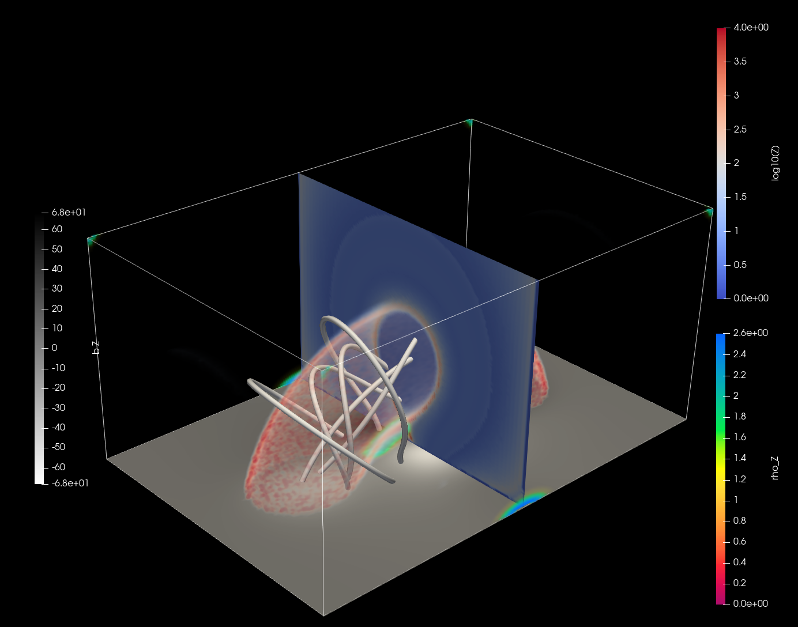

.. ########################################################################
.. ########################################################################
.. #   This file is part of QSL Squasher. 
.. #   Copyright (C) 2014, 2015, 2016  Svetlin Tassev
.. #   						 Harvard-Smithsonian Center for Astrophysics
.. #   						 Braintree High School
.. #   
.. #    QSL Squasher is free software: you can redistribute it and/or modify
.. #    it under the terms of the GNU General Public License as published by
.. #    the Free Software Foundation, either version 3 of the License, or
.. #    (at your option) any later version.
.. #   
.. #    This program is distributed in the hope that it will be useful,
.. #    but WITHOUT ANY WARRANTY; without even the implied warranty of
.. #    MERCHANTABILITY or FITNESS FOR A PARTICULAR PURPOSE.  See the
.. #    GNU General Public License for more details.
.. #   
.. #    You should have received a copy of the GNU General Public License
.. #    along with this program.  If not, see <http://www.gnu.org/licenses/>.
.. #   
.. ########################################################################
.. ########################################################################

.. _example-section:

Worked-out example
==================

The default options in the code generate a *very low-resolution* 3d cube 
of Q values with the sample dataset included with the code. Running the code with those 
options using the commands listed below, generates the following 3d view 
in ``ParaView``, which includes a magnetogram, volumetric rendering of 
Q values, as well as traced field lines:

The command lines below show a typical sequence of commands to generate 
a 3d data cube of Q values, and then visualize the result. The example 
uses the data files distributed with the code and was run on the *CPU* 
of a low-end laptop. The calculation of about half a million 
Q values, post-processing and rendering took less than 5 minutes with the 
default settings. Note that in the session below, qslSquasher was 
killed after two mesh refinements. ::

	$ time ./compile.sh 
	  
	  real	0m28.613s
	  user	0m27.370s
	  sys	0m0.417s
	$ time ./qslSquasher > raw.dat
	  1. Intel(R) Core(TM) i5-5200U CPU @ 2.20GHz (Intel(R) OpenCL)
	  
	  Reading successful.
	  Integration step set at 0.022446 Mm
	  Initialization successful.
	  Number of field lines to be integrated in this mesh refinement step: 262144
	  Beginning FORWARD integration along field lines ...
	  # of computed field lines = 0 out of 262144 in mesh refinement: 0
	  # of computed field lines = 103793 out of 262144 in mesh refinement: 0
	 	 ... skipping lines ...
	  # of computed field lines = 262118 out of 262144 in mesh refinement: 0
	  Beginning BACKWARD integration along field lines ...
	  # of computed field lines = 0 out of 262144 in mesh refinement: 0
	 	 ... skipping lines ...
	  # of computed field lines = 262118 out of 262144 in mesh refinement: 0
	  Q values calculated successfully.
	  Starting sort...
	  ... done sorting.
	  Starting sort...
	  ... done sorting.
	  Number of field lines to be integrated in this mesh refinement step: 34352
	  Beginning FORWARD integration along field lines ...
	  # of computed field lines = 0 out of 34352 in mesh refinement: 1
	 	 ... skipping lines ...
	  # of computed field lines = 34250 out of 34352 in mesh refinement: 1
	  Q values calculated successfully.
	  Starting sort...
	  ... done sorting.
	  Starting sort...
	  ... done sorting.
	  Number of field lines to be integrated in this mesh refinement step: 34609
	  Beginning FORWARD integration along field lines ...
	  # of computed field lines = 0 out of 34609 in mesh refinement: 2
	 	 ... skipping lines ...
	  # of computed field lines = 34597 out of 34609 in mesh refinement: 2
	  Q values calculated successfully.
	  Starting sort...
	  ... done sorting.
	  Starting sort...
	  ... done sorting.
	  Number of field lines to be integrated in this mesh refinement step: 41122
	  Beginning FORWARD integration along field lines ...
	  # of computed field lines = 0 out of 41122 in mesh refinement: 3
	 	 ... skipping lines ...
	  # of computed field lines = 41018 out of 41122 in mesh refinement: 3
	  Q values calculated successfully.
	  Starting sort...
	  ... done sorting.
	  Starting sort...
	  ... done sorting.
	  Number of field lines to be integrated in this mesh refinement step: 48880
	  Beginning FORWARD integration along field lines ...
	  # of computed field lines = 0 out of 48880 in mesh refinement: 4
	 	 ... skipping lines ...
	  # of computed field lines = 48866 out of 48880 in mesh refinement: 4
	  Q values calculated successfully.
	  ^C
	  real	2m23.511s
	  user	8m17.523s
	  sys	0m25.037s
	$ time ./snapshot > grid3d.dat 
	  
	  real	0m1.999s
	  user	0m1.937s
	  sys	0m0.060s
	$ time python2 viz3d.py
	  
	  real	0m7.020s
	  user	0m6.450s
	  sys	0m0.317s
	$ paraview --state=viz3d_paraview.pvsm
	

The example above is for input in cartesian coordinates. It generates 
several output files:

* :file:`raw.dat` contains the raw output from :download:`qslSquasher.cpp`.

* :file:`grid3d.dat` is the result of the first post-processing step done by :download:`snapshot.cpp`.

* :file:`SquashingFactor_CartCoo.vtr` is a VTK file, containing the 
  rectilinear grid of Q values in cartesian coordinates. 
  
* :file:`MagneticField_CartCoo.vtr` is a VTK file, containing the 
  rectilinear grid of magnetic field component values in 
  cartesian coordinates. This file is generated from the input files 
  used by ``qslSquasher``.
  
The last two files are used by the included :download:`ParaView session file <viz3d_paraview.pvsm>` 
to generate the figure shown in the beginning of this section.
